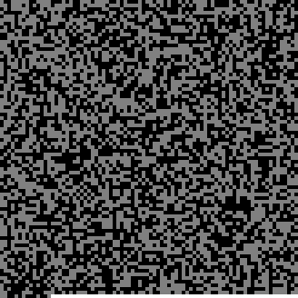

# DataEncryption

A simple Python project that encrypts text using **AES-256** and embeds the encrypted data into a generated image (black, gray, and white blocks). It also provides a decoder to extract and decrypt the hidden message from the image.

## Features

- **Encryption**: Uses AES-256 (CBC mode) with a user-provided key.
- **Image Generation**: Converts encrypted bits into a grid of colored squares.
- **Decoding**: Recovers and decrypts the hidden message from the image.

## Requirements

- **Python 3.7+**  
- **Pygame**  
- **Pillow (PIL)**  
- **cryptography**  

Install dependencies with:
```bash
pip install pygame pillow cryptography
```

## Usage

1. **Encoding (creating the image):**  
   - Open a terminal in the project folder.
   - Run `Encoder.py` and enter your text and encryption key when prompted (or modify the script to include them directly).
   - Example:
     ```bash
     python Encoder.py
     ```
   - An image (e.g., `test.png`) will be generated with your encrypted data.

2. **Decoding (extracting the message):**  
   - Run `Decoder.py` and provide the path to your generated image, plus the same key used for encryption.
   - Example:
     ```bash
     python Decoder.py
     ```
   - The script will print the decrypted message if the correct key is provided.

## How It Works

- **Encryption**:  
  - A key is hashed (SHA-256) to create a 32-byte key.  
  - The text is padded and encrypted in CBC mode.  
  - An Initialization Vector (IV) is prepended to the encrypted data.

- **Image Generation**:  
  - The encrypted data is converted to bits.  
  - Each bit is represented as either a black or gray square on a Pygame surface.  
  - Any unused space is filled with white squares.  
  - The surface is saved as an image (PNG).

- **Decoding**:  
  - Reads the image pixel by pixel to reconstruct the bitstream.  
  - Separates the IV from the ciphertext.  
  - Decrypts the data using the same AES key and IV.

## Project Structure

```
DataEncryption/
├── Encoder.py    # Encrypts text and generates the image
├── Decoder.py    # Reads the image and decrypts the message
└── test.png      # Sample output image (or placeholder)
```

## Image Test-subject


#### Message: Hello World I am a Python Programmer.
#### Key: 100


## Image Test-subject2


#### Message:??
#### Key:n7V2LgQe%R


## Contributing

Feel free to open an issue or submit a pull request if you have suggestions or improvements.
